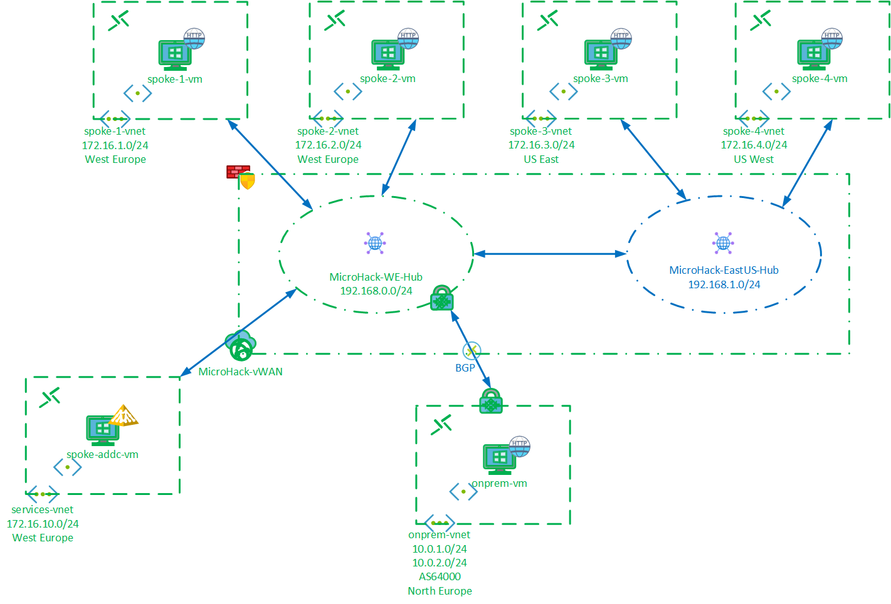
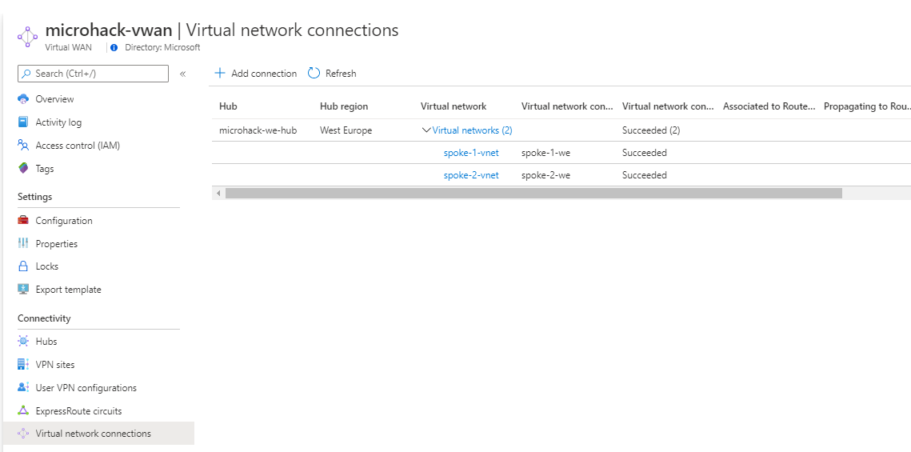
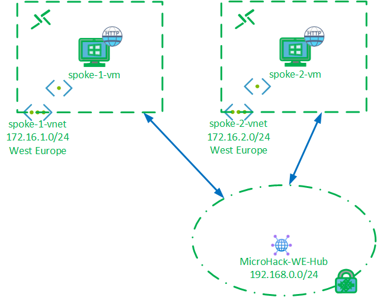

# **Routing in Azure Virtual WAN MicroHack**

# Contents
[Introduction](#introduction)

[Objectives](#objectives)

[Scenario](#scenario)

[Lab](#lab)

[Prerequisites](#prerequisites)

[Scenario 1: Single region Virtual WAN with Default Routing](#scenario-1-single-region-virtual-wan-with-default-routing)

[Scenario 2: Add a Branch]
(#scenario-2-add-a-branch)

[Scenario 3: Multi-region VWAN with Isolated Spokes and Shared Services Spoke](#scenario-3-multi-region-vwan-with-isolated-spokes-and-shared-services-spoke)

[Scenario 4: Filter traffic through a Network Virtual Appliance](#scenario-4-filter-traffic-through-a-network-virtual-appliance)

[Scenario 5: Secured Hubs](#scenario-5-secured-hubs)

[Close out](#close-out)

# Introduction
This MicroHack explores some of the advanced routing capabilities recently introduced into Azure Virtual WAN. 

The lab starts with a single Hub with Spoke VNETs and default routing. We will then add a Shared Services VNET. Next, a simulated on-premise location connected via site-to-site VPN is attached, with custom routing. Then we will add another regional Hub with Spokes and will observe how routing extends across multiple Hubs. 

Finally, we will use Azure Firewall Manager to convert our Hubs into Secured Hubs, adding Azure Firewall, and explore secured interhub routing.

Prior to starting this MicroHack, please familiarize yourself with routing in Virtual WAN by reviewing the documentation at https://docs.microsoft.com/en-us/azure/virtual-wan/virtual-wan-about and https://docs.microsoft.com/en-us/azure/virtual-wan/about-virtual-hub-routing.

# Objectives
After completing this MicroHack you will:
-	Know how to build a hub-and-spoke topology with Virtual WAN
-	Understand default routing in Virtual WAN and how this differs from the classic virtual data center hub-and-spoke spoke architecture 
-	Understand how custom routing works and know how to build some custom routing scenarios
-	Know how to implement network security in Virtual WAN with a Network Virtual Appliance, and with Secure Hubs

# Lab

The lab consists of a Virtual WAN with a Hub in West Europe, 4 Spoke VNETs (2 in West Europe, 1 in US East and 1 in US West), a Shared Services VNET and an NVA VNET in West-Europe and a simulated On-premise location in North Europe. 

Each Spoke and On-prem VNET contains a Virtual Machine running a basic web site, the Shared Services VNET contains an Active Directory Domain Controller, the NVA VNET contains a Linux VM with Iptables.

During the course of the MicroHack you will connect the Spoke and Shared Services VNETs and the On-premise site to Virtual WAN, deploy an additional Virtual WAN Hub, and manipulate and observe routing. 

At the end of the lab your deployment looks like this:

Although a Branch (site-to-site VPN) connection is part of this MicroHack, it does not cover the integration with products from  SDWAN partners.
# Prerequisites
To make the most of your time on this MircoHack, the green elements in the diagram above are deployed and configured for you through Terraform. You will focus on deploying and configuring the blue items using the portal.
## Task 1: Deploy
Steps:
- Log in to Azure Cloud Shell at https://shell.azure.com/ and select Bash
- Clone the  GitHub repository:
  
`git clone https://github.com/mddazure/azure-vwan-microhack`
  
  - Change directory to ./azure-vwan-microhack
  - Initialize terraform and download the azurerm resource provider:

`terraform init`

- Now start the deployment (when prompted, confirm with **yes** to start the deployment):
 
`terraform apply`

Deployment takes approximately 30 minutes. 
## Task 2: Explore and verify

After the Terraform deployment concludes successfully, the following has been deployed into your subscription:
- A resource group named **vwan-microhack-spoke-rg** containing
  - Four Spoke VNETs, each containing a Virtual Machine running a simple web site, and a Bastion Host.
  - An Onprem VNET containing a Virtual Machine running a simple web site, a VNET Gateway and a Bastion Host.
  - A Services VNET containing and a Virtual Machine configured as an Active Directory Domain Controller, and a Bastion Host.
  - An NVA VNET containing a Virtual Machine with Linux (Ubuntu 18.4) and Iptables installed, and a Bastion Host.
- A resource group named **vwan-microhack-hub-rg** containing a Virtual WAN resource with one Hub and one VPN Gateway. You will deploy another Hub into this resourcegorup manually later on.

Verify these resources are present in the portal.

Credentials are identical for all VMs, as follows:
- User name: AzureAdmin
- Password: Microhack2020
- Domain: micro-hack.local (this is on the ADDC VM only, the other VMs are not joined to this domain yet)

You may log on to each VM through Bastion. Disable IE Enhanced Security Configuration in Server Manager, open Internet Explorer and access http://localhost. You will see  a blank page with the VM name in the upper left corner. When logging on to the ADDC VM before it is ready, you will see "Waiting for the Group Policy Client". That is OK, just let it run while you proceed with the lab.
# Scenario 1: Single Region Virtual WAN with Default Routing
## Goal
In this Challenge you will connect in-region VNETs to the pre-deployed Hub, and establish VNET-to-VNET communication. You will then inspect effective routes on the spoke VMs and take a look at the VWAN Default routing table.
## Task 1: Baseline
Connect to spoke-1-vm via Bastion, turn off IE Enhanced Security Configuration in Server Manager, open Internet Explorer and attempt to connect to spoke-2-vm at 172.16.2.4.

Does it connect?

Check the routing on spoke-1-vm, as follows:

In the portal, in the Properties view of the VM Overview blade, click on Networking. Then click on the name of the Network Interface. The NIC overview shows, under Support + troubleshooting click Effectice routes.

Alternatively, in Cloud Shell, issue this command:

`az network nic show-effective-route-table -g vwan-microhack-spoke-rg -n spoke-1-nic --output table`

Is there a specific route for spoke-2-vnet (172.16.2.0/24)?

## Task 2: Connect VNETs
In the portal, navigate to the Virtual WAN named **microhack-vwan** in resource group **vwan-microhack-hub-rg**. 

Click "Virtual network connections" under "Connectivity" and click "+ Add connection" at the top of the page.
Name your connection **spoke-1-we**, select the hub and in the Resource group drop down select **vwan-microhack-spoke-rg**. In the Virtual network drop down, select **spoke-1-vnet** and click Create. Wait for the connection to complete and do the same for **spoke-2-vnet**.

Your Virtual WAN now looks like this:

Can you now browse from spoke-1-vm to spoke-2-vm and vice versa?

### :point_right: Spoke routes
Again observe Effective Routes for spoke-1-vm.

Notice it now has a route for spoke-2-vnet (172.16.2.0/24), pointing to a public address. This is the address of the Route Service, deployed into the Hub to enable routing between peered VNETs, branch connections and other Hubs. The fact that this is a public IP address does not present a security risk, it is not reachable from the internet.

Notice that the routes that enable spoke-to-spoke communication were plumbed into the spoke VNETs automatically. Contrast this with a "classic" hub-and-spoke architecture, where you would need to set up a routing device in the hub VNET and then put UDRs in each of the spokes manually.

### :point_right: Hub routes
Navigate to the blade for the MicroHack-WE-Hub in your Virtual WAN and select Routing under Connectivity. Notice there are two Route tables present now: Default and None.

A Virtual WAN can contain multiple Route tables, and we'll add some in the course of this MicroHack. Each Connection (Hub-to-Spoke VNET, ExpressRoute, S2S (Branch) VPN or P2S (User) VPN) can be *Associated* with a single table and be *Propagating* to multiple tables.

The Default table has Associated Connections and Propagating Connections. Click on ... at the end of the row to see that both Spoke VNETs are Associated with and Propagating to the Default table.

*Associated* means that traffic from the Connections listed is governed by this table, in this case the Default route table. This table decides where traffic sent from the connection to the VWAN Route Service (remember the route entry pointing to the public IP address in the Spoke VM's Effective Routes) goes.

*Propagating* means that the Connection's destinations are entered into this Routing table: the table learns the Connection's routes. 

The None Route table is also present for each Hub; traffic from Connections Associated with this Route table is dropped. 

Click on Effective Routes at the top of the page. In the drop downs on the next page, select Route Table and Default respectively. This brings up the Default route table. Note that routes for the prefixes of both connected VNETs are present, pointing to the respective VNET connections.

Scenario 2: Add a Branch

Now let's add a Branch location.

## Task 1: Connect a simulated branch site
Now connect a branch site via a BGP-enbaled VPN connection and explore the routing between spokes and the branch. The branch site is simulated through a VNET with a VNET Gateway which was deployed through Terraform as part of the Prerequisites.

In Cloud Shell, in the azure-vwan-microhack directory
- Run the connect-branch shell script:

`./connect-branch.sh`

The script contains Azure CLI commands that create following resources:
- A VPN Site named "onprem" in the Virtual WAN
- A BGP-enabled VPN connection from the "onprem" site to the West Europe Hub
- A Local Network Gateway named "lng" to represent the West Europe Hub
- A BGP-enabled VPN connection from the Gateway in "onprem-vnet" to the Local Network Gateway

After the script completes, it may take a few minutes for the connection to show "Connected" in the portal.

Your Virtual WAN now looks like this:

## Task 2: Verify connectivity
Connect to onprem-vm via Bastion and turn off IE Enhanced Security Configuration in Server Manager.

Open Internet Explorer and browse to spoke-1-vm at 172.16.1.4 and spoke-2-vm at 172.16.2.4.

Does it connect?
## Task 3: Inspect routing
### :point_right: BGP routing exchange over VPN
In Cloud Shell, in the azure-vwan-microhack directory
- Run the branch-routes script:

`./branch-routes.sh`

This scripts pulls information on the BGP session from the VNET Gateway vnet-onprem-gw. 

Note that the "routes learned" output contains all routes the Gateway knows: those that are in the same VNET, with "origin" indicating "Network", as well as routes learned from the Virtual WAN Hub via BGP with "origin" indicating "EBgp". 

### :point_right: Branch routes
Now observe Effective Routes for onprem-vm.

The routes for the spoke VNETs were learned via BGP and programmed into the vm route table automatically, without the need to install UDRs.

### :point_right: Spoke routes
Again observe Effective Routes for spoke-1-vm, as follows:

In the portal, in the Properties view of the VM Overview blade, click on Networking. Then click on the name of the Network Interface. The NIC overview shows, under Support + troubleshooting click Effective routes.

Alternatively, in Cloud Shell, issue this command:

`az network nic show-effective-route-table -g vwan-microhack-spoke-rg -n spoke-1-nic --output table`

 Notice that it now has routes for the IP ranges of the onprem site, 10.0.1.0/24 and 10.0.2.0/24. This site is connected via VPN, and although "Source" and "Next Hop Type" are the same as for peered VNET spoke-2-vnet, the next hop address is different.
 
 Whereas the next hop for spoke-vnet-2 is the Hub routing engine, the next hop for VPN connection is the VPN Gateway, which has a private IP address from the range assigned to Hub.

The routes for the VPN connection where plumbed into the spoke automatically and there is no need to place User Defined Routes in the spoke VNETs.

### :point_right: Hub routes
Again observe the Effective routes of the Default route table. Note that routes for the on-prem site's prefixes are now present, pointing to S2S VPN Gateway. Realize that the Route Service itself is not in the data path for branch traffic. The Route Service acts as a route reflector, traffic flows directly between the VM in the spoke and VPN Gateway.

# Scenario 3: Multi-region VWAN with Isolated Spokes and Shared Services Spoke
Imagine an IT department that must facilitate DevOps teams. IT operates a number of central services, such as the network in and between Azure and on-premise, and the Active Directory domain. DevOps teams are given their own VNETs in Azure, connected to a central hub facility that provides connectivity and the domain. The DevOps teams operate independently and their environments must remain isolated from each other.

This scenario adds a Shared Services Spoke with a Domain Controller, and changes the routing so that the Spokes can only reach the Branch and the Shared Services Spoke. An additional Hub is also added.

At the and of this scenario, your lab looks like this:

## Task 1: Add a Hub

In the portal, Select your **microhack-vwan**. Under Connectivity, select Hubs, then +New Hub at the top of the page and complete the Basics dialog as follows:
- Region: East US
- Name: microhack-useast-hub
- Hub private address space: 192.16.1.0/24

As this Hub will not contain any gateways, skip the other tabs, click Review + create and then Create.

Alternatively, in Cloud Shell, issue this command:

`az network vhub create --address-prefix 192.168.1.0/24 --name microhack-useast-hub --resource-group vwan-microhack-hub-rg --location useast --sku Standard`

## Task 2: Connect VNETs
Connect spoke-3-vnet and spoke-4-vnet to the new Hub. We connected VNETs through the portal in Scenario 1. Now we'll do this through the shell script provided. In Cloud Shell, enter

`./connect-us-east-spokes.sh`

This will take a few minutes to complete. While the script runs, you can see the connections being added in the portal in microhack-vwan under Connectivity, Virtual network connections. Wait for both Connections to show status Succeeded.

## Task 3: Verifiy connectivity and inspect routing
Connect to spoke-1-vm via Bastion. Open Internet Explorer, browse to spoke-3-vm at 172.16.3.4 and to spoke-4-vm at 172.16.4.4.

Do the same from on-prem-vm.

Do you see the web pages from spoke-3-vm and spoke--4vm?

:point_right: Spoke routes
Observe Effective Routes for spoke-1-vm, either in the portal or in Cloud Shell through 

`az network nic show-effective-route-table -g vwan-microhack-spoke-rg -n spoke-1-nic --output table`

Which routes have been added to spoke-1-vm's route table? What is the next hop for the new routes?

Again, realize that Virtual WAN installed these routes automatically!

# Scenario 4: Filter traffic through a Network Virtual Appliance

# Scenario 5: Secured Hubs

# Close out

  

